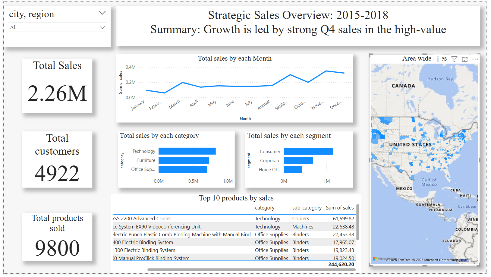

# End-to-End Sales Performance Analysis & Interactive Dashboard

---

## 🎯 Project Objective

To analyze the "Superstore" dataset to identify key drivers of sales and profit, uncover regional performance insights, and develop an interactive Power BI dashboard to provide actionable recommendations for sales strategy enhancement. This project showcases an end-to-end data analysis workflow, from raw data processing to strategic business intelligence.

---

## 🛠️ Technical Skills Showcase

* **Data Cleaning & Transformation:** SQL (PostgreSQL)
* **Data Loading:** Python (Pandas, Psycopg2)
* **Data Visualization & BI:** Power BI
* **Version Control:** Git & GitHub

---

## 📊 The Process

1.  **Data Loading:** A Python script was developed to efficiently load the raw CSV data into a PostgreSQL database, ensuring data integrity from the start.
2.  **Data Cleaning & Preparation (SQL):** A comprehensive SQL script was executed to clean the data. This included correcting data types, handling non-numeric characters, trimming whitespace, and creating calculated columns like `days_to_ship` to enrich the dataset for analysis.
3.  **Dashboard Development (Power BI):** The cleaned data was connected to Power BI to build a dynamic dashboard. The design focuses on a "storytelling" layout, guiding the user from high-level KPIs to granular details.
4.  **Insight Generation:** The final dashboard was used to analyze trends, identify correlations, and derive the actionable insights listed below.

---

## 💡 Key Insights & Actionable Recommendations

### 1. Insight: Strong Seasonal Sales Cycle
* **Finding:** Sales consistently spike in Q4 (November/December) and dip in Q1.
* **Recommendation:** Implement a targeted marketing campaign in Q1 to mitigate the seasonal slump and optimize inventory and staffing for the predictable Q4 rush.

### 2. Insight: High-Value Products Drive Revenue
* **Finding:** The "Technology" category is the top revenue generator, despite "Office Supplies" having a higher sales volume.
* **Recommendation:** Focus marketing and promotional efforts on high-margin technology products. Create product bundles combining top-selling tech items with relevant accessories to increase average order value.

### 3. Insight: Core Customer & Geographic Markets
* **Finding:** The "Consumer" segment accounts for over 50% of all sales, with California and New York being the top two revenue-generating states.
* **Recommendation:** Develop a loyalty program for the Consumer segment and launch geo-targeted digital marketing campaigns in top-performing states to deepen market penetration.

---

## 🖼️ Final Dashboard Preview

---

## 📞 Contact

* **LinkedIn:** www.linkedin.com/in/hemesh-babu-ponthala
* **Email:** ponthalahemeshbabu@gmail.com
